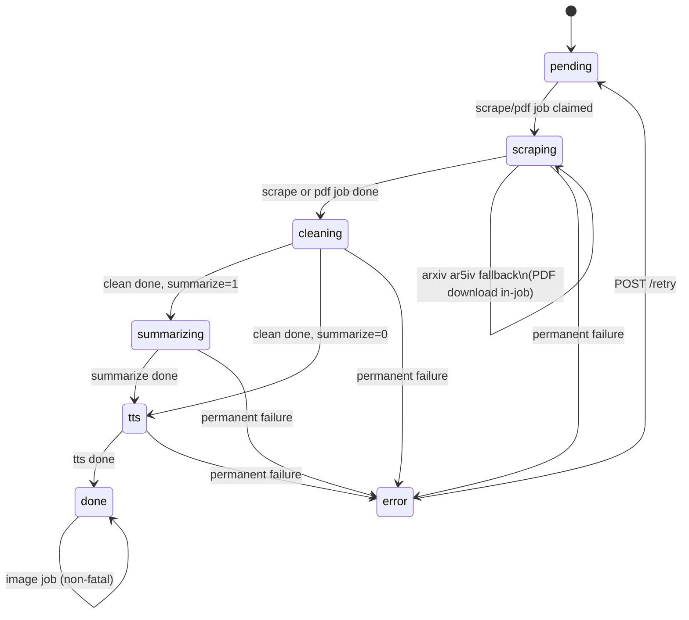
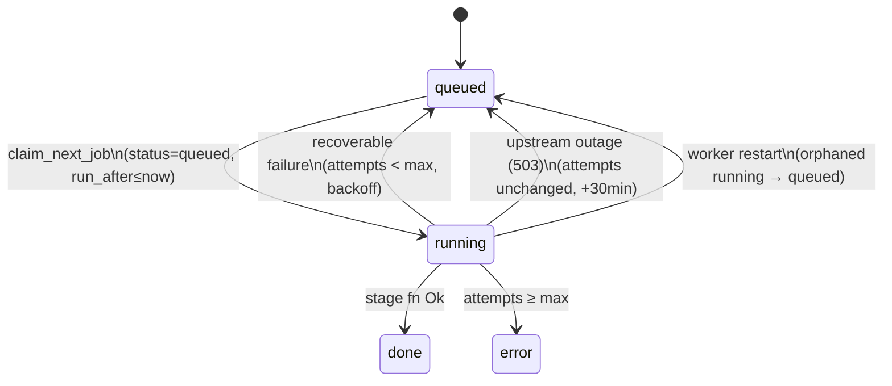

# TTS Podcast — Design

## Overview

A self-hosted service that converts web articles, arXiv papers, and PDFs into podcast episodes. Submissions come in via a small web UI or the HTTP API; the backend runs a multi-stage pipeline (scrape/extract → clean → optionally summarize → TTS → cover image) and publishes a per-feed RSS document that podcast clients can subscribe to.

Access control is intentionally minimal: an `ADMIN_TOKEN` gates feed creation/deletion, and each feed has a per-feed `feed_token` (UUID) that acts as both the RSS URL secret and the auth token for episode-level operations.

## System Architecture

```
┌───────────────────────────────────────────────────────────┐
│                  Fly.io — single app                      │
│                                                           │
│  ┌─────────────────────────────────────────────────────┐  │
│  │  Rust / Axum binary (tts-podcast-backend)           │  │
│  │    • HTTP API  (/api/v1/…)                          │  │
│  │    • RSS       (/feed/:token/rss.xml)               │  │
│  │    • Static    (SvelteKit build at /app/static)     │  │
│  │    • Worker    (inline job processor)               │  │
│  └───┬─────────────────────────────┬───────────────────┘  │
│      │                             │                      │
│  ┌───▼──────────┐              ┌───▼────────────┐         │
│  │  SQLite      │              │  Tigris (S3)   │         │
│  │  /data/…     │◄─Litestream─▶│  audio/        │         │
│  │  WAL mode    │   continuous │  images/       │         │
│  └──────────────┘   replication│  litestream/   │         │
│                                └────────────────┘         │
└───────────────────────────────────────────────────────────┘
            │              │                │
     ┌──────▼───┐    ┌─────▼─────┐    ┌─────▼────────┐
     │ Anthropic│    │ Google    │    │ Google AI    │
     │ Claude   │    │ Cloud TTS │    │ Studio       │
     │          │    │           │    │ (Gemini)     │
     └──────────┘    └───────────┘    └──────────────┘
```

The backend is a workspace of three crates:

- `tts-lib` — pipeline building blocks: providers (Claude, Gemini), scraping (readability, arXiv), PDF extraction, cleanup prompts, summarization, TTS chunking, image generation.
- `tts-cli` — a thin CLI that drives `tts-lib` for local testing.
- `server` — Axum HTTP surface, SQLite persistence, job worker; builds the `tts-podcast-backend` binary.

## Data Model

SQLite with WAL mode. Migrations live in `backend/server/migrations/` and are embedded in the binary.

### `feeds`

| Column | Type | Purpose |
|---|---|---|
| id | TEXT (UUID) | Primary key |
| slug | TEXT | Human label (`"ml-papers"`) |
| title | TEXT | Display title |
| description | TEXT | Feed description |
| feed_token | TEXT (UUID) | Secret used in RSS URL and API auth |
| tts_default | TEXT | Default TTS provider |

### `episodes`

| Column | Type | Purpose |
|---|---|---|
| id | TEXT (UUID) | Primary key |
| feed_id | TEXT | Parent feed |
| title | TEXT | Article/paper title |
| source_url | TEXT | Original URL (optional for PDF uploads) |
| source_type | TEXT | `"article"`, `"arxiv"`, or `"pdf"` |
| raw_text | TEXT | Output of scrape/PDF extraction |
| cleaned_text | TEXT | Output of the clean stage |
| transcript | TEXT | Summarized version (when `summarize = 1`) |
| summarize | INTEGER | 0/1 flag requested at submission |
| audio_url | TEXT | Public Tigris URL for the MP3 |
| image_url | TEXT | Public Tigris URL for the cover image (nullable) |
| duration_secs | INTEGER | Exact MP3 duration |
| word_count | INTEGER | Of the text that was spoken |
| tts_provider | TEXT | Provider actually used |
| tts_chunks_done / tts_chunks_total | INTEGER | Progress reporting |
| status | TEXT | See state machine below. `pending`, `scraping`, `cleaning`, `summarizing`, `tts`, `done`, or `error` |
| error_msg | TEXT | Last error |

When `transcript` is non-null the TTS stage speaks it; otherwise it speaks `cleaned_text`.

The API decorates each episode with a derived `retry_at` field — the `run_after` of the earliest `queued` job whose `run_after` is in the future. When set, the UI shows a "waiting on retry" banner. Episodes in this state keep their prior `status` (e.g. `scraping`) because the stage hasn't moved; `retry_at` is the signal that it's paused rather than actively working.

### `jobs`

| Column | Type | Purpose |
|---|---|---|
| id | INTEGER | Primary key |
| episode_id | TEXT | Target episode |
| job_type | TEXT | `scrape`, `pdf`, `clean`, `summarize`, `tts`, `image` |
| status | TEXT | `queued` → `running` → `done`/`error` |
| attempts | INTEGER | Retry count |
| run_after | TEXT | ISO8601, for delayed retries |

The worker runs jobs inline (no `spawn`) to avoid concurrent SQLite writers. On startup, any job left in `running` (e.g. from a crash or deploy) is reset to `queued` so it's picked up again.

## API

Base path: `/api/v1`. Admin endpoints require `Authorization: Bearer $ADMIN_TOKEN`. Token-authed endpoints use the feed's `feed_token` in the URL.

### Feeds

| Method | Path | Auth | Notes |
|---|---|---|---|
| POST | `/api/v1/feeds` | Admin | Create |
| GET | `/api/v1/feeds` | Admin | List |
| GET | `/api/v1/feeds/:token` | Token | Feed + episodes |
| DELETE | `/api/v1/feeds/:token` | Admin | Delete |

### Episodes

| Method | Path | Auth | Notes |
|---|---|---|---|
| POST | `/api/v1/feeds/:token/episodes` | Token | Body: `{ url, summarize?, tts_provider? }` |
| POST | `/api/v1/feeds/:token/episodes/pdf` | Token | Multipart: `file`, `title?`, `source_url?`, `summarize?` |
| GET | `/api/v1/feeds/:token/episodes/:id` | Token | Includes progress and status |
| GET | `/api/v1/feeds/:token/episodes/:id/text` | Token | Raw / cleaned / transcript text |
| POST | `/api/v1/feeds/:token/episodes/:id/retry` | Token | Re-queue a failed episode from its last successful stage |
| DELETE | `/api/v1/feeds/:token/episodes/:id` | Token | Delete (also removes storage objects) |

### RSS

| Method | Path | Notes |
|---|---|---|
| GET | `/feed/:token/rss.xml` | RSS 2.0 + iTunes namespace; per-episode `<itunes:image>` |

## Processing Pipeline

### Episode state machine



Notes:
- `scraping` covers both the `scrape` and `pdf` job types (one or the other is queued at submission, never both).
- On submission: URL-based episodes enqueue a `scrape` job; PDF uploads enqueue a `pdf` job.
- The `image` job runs after the episode is already `done`; its failure is logged but doesn't move the episode back to `error`.
- Jobs in backoff (including 30min upstream-outage deferral) keep the episode in its current stage; the UI distinguishes "actively working" from "waiting on retry" via the derived `retry_at` field, not an episode status change.

### Job state machine



Standard retry backoff is exponential: 2, 4, 8, … minutes capped at `MAX_JOB_ATTEMPTS`. Errors matching an upstream-outage pattern (`503`, `service unavailable`, `overloaded`, `unavailable`) defer 30min and do **not** consume a retry attempt, so a long provider outage can't permanently fail an episode.

### Scrape (URL sources)

- **Articles**: HTTP GET → `readability` extraction, then light HTML-to-text.
- **arXiv**: metadata from the arXiv API; body from `ar5iv.org` (LaTeX-rendered HTML), which preserves equation structure better than the PDF path.
- **arXiv fallback**: ar5iv sometimes 200s with a "Conversion to HTML had a Fatal error" body, or returns suspiciously short content. Both cases are caught as errors. For `source_type = "arxiv"` the scrape stage then downloads `https://arxiv.org/pdf/{id}` to `/data/{episode_id}.pdf` and delegates to the PDF stage in-process, so the job completes as a scrape and the episode proceeds to `cleaning` normally.

### PDF

PDFs come from two places: direct user uploads (`POST /episodes/pdf`, optionally with a `source_url`) and the arXiv fallback described above. The bytes are fed page-by-page to the configured extractor (`PDF_EXTRACTOR=gemini` by default; `claude` is the alternative). Pages blocked by the provider's content filter are skipped rather than failing the job. `poppler-utils` is installed in the runtime image for ancillary PDF inspection.

### Clean

Source-type-specific system prompts:

- **Articles** (Claude Sonnet): strip navigation chrome, fix mojibake, normalize punctuation.
- **arXiv / PDF** (Claude Opus): rewrite inline LaTeX as spoken English, drop raw citations, delete figure captions that don't read well aloud.

The provider is abstracted behind `tts_lib::Provider` (`Claude { api_key }` or `Gemini { api_key, model }`), so either backend can be swapped in.

### Summarize (optional)

When the submission sets `summarize: true`, an extra stage produces a shorter spoken version stored as `transcript`. Useful for long papers when you want the gist rather than the whole thing. The UI exposes this as a checkbox on the submit form.

### TTS

Google Cloud Text-to-Speech, Journey voices by default (`GOOGLE_TTS_VOICE`, defaults to `en-US-Journey-D`). Text is split at sentence boundaries into ~4000-char chunks, each synthesized separately; MP3 frames are concatenated. Exact duration is computed with the `mp3-duration` crate. Progress is reported via `tts_chunks_done/total`.

### Cover Image

Runs after the episode reaches `done`, so audio is available before the image. The cleaned text is summarized into a short visual brief, then Gemini 2.5 Flash Image generates an illustration. Failures are logged but don't fail the episode.

### Retries

See the job state machine above. Transient failures retry with exponential backoff (capped by `MAX_JOB_ATTEMPTS`, default 3); upstream provider outages defer 30min without consuming an attempt; permanent failures move the episode to `error`, from which `POST /retry` re-queues it from the last successful stage.

## Frontend

SvelteKit (Svelte 5) built with `adapter-static` and served by Axum from `STATIC_DIR`. Three pages:

1. `/` — admin view with feed list, create/delete.
2. `/feeds/[token]` — submission form (URL or PDF upload, with summarize checkbox), episode list, status polling every 5 seconds.
3. `/feeds/[token]/episodes/[id]` — audio player, cover image, metadata, retry button.

## Configuration

All configuration is via environment variables. `.env.example` is the canonical list.

**Required**: `DATABASE_URL`, `ANTHROPIC_API_KEY`, `GOOGLE_TTS_API_KEY`, `GOOGLE_STUDIO_API_KEY`, `ADMIN_TOKEN`, `AWS_ACCESS_KEY_ID`, `AWS_SECRET_ACCESS_KEY`, `AWS_ENDPOINT_URL_S3`, `BUCKET_NAME`.

**Optional**: `GOOGLE_TTS_VOICE`, `GENERATE_IMAGES`, `PUBLIC_URL`, `HOST`, `PORT`, `STATIC_DIR`, `WORKER_POLL_INTERVAL_SECS`, `MAX_JOB_ATTEMPTS`, `PDF_EXTRACTOR` (`gemini` default, `claude` alternative).

## Deployment

One Fly.io app, one volume (`/data` for SQLite), one Tigris bucket. Litestream supervises the backend process so any crash tears down replication cleanly. See [DEPLOYMENT.md](DEPLOYMENT.md).
